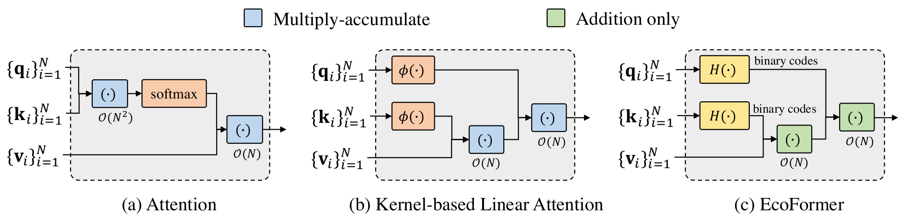

# EcoFormer: Energy-Saving Attention with Linear Complexity（NeurIPS 2022 Spotlight) 🚀
<a href="https://arxiv.org/abs/2209.09004"></a> 
[](https://opensource.org/licenses/Apache-2.0) 
<a href="https://pytorch.org/get-started/locally/"></a>

This is the official PyTorch implementation of [EcoFormer: Energy-Saving Attention with Linear Complexity](https://arxiv.org/abs/2209.09004) by [Jing Liu](https://scholar.google.com/citations?user=-lHaZH4AAAAJ&hl=en), [Zizheng Pan](https://scholar.google.com.au/citations?user=w_VMopoAAAAJ&hl=en), [Haoyu He](https://scholar.google.com.au/citations?user=aU1zMhUAAAAJ&hl=en), [Jianfei Cai](https://scholar.google.com/citations?user=N6czCoUAAAAJ&hl=en), and [Bohan Zhuang](https://scholar.google.com.au/citations?user=DFuDBBwAAAAJ).

## News

- **11/11/2022.** EcoFormer is selected as Spotlight!
- **08/10/2022.** We release the source code. Any issues are welcomed!
- **15/09/2022.** EcoFormer is accepted by NeurIPS 2022! 🔥🔥🔥

## A Gentle Introduction


We present a novel energy-saving attention mechanism with linear complexity, called EcoFormer, to save the vast majority of multiplications from a new binarization perspective. More details can be found in our [paper](https://arxiv.org/abs/2209.09004).

## Installation

### Requirements

- Python ≥ 3.8
- PyTorch 1.10.1
- CUDA 11.1
- Torchvision 0.11.2
- PyTorch Image Models (timm) 0.4.9
- MMCV 1.3.8
- Einops 0.4.1
- SciPy 1.8.0

### Instructions

Use [Anaconda](https://www.anaconda.com) to create the running environment for the project, kindly run

```bash
git clone https://github.com/ziplab/EcoFormer
cd EcoFormer
conda env create -f environment/environment.yml
conda activate ecoformer
```

**Note**: If the above instructions does not work on your machine, please refer to [environment/README.md](./environment/README.md) for manual installation and trouble shootings.

## Getting Started

For experiments on PVTv2, please refer to [pvt](./pvt).

For experiments on twins, please refer to [twins](./twins).

## Results and Model Zoo

| Model       | #Mul. (B) | #Add. (B) | Energy (B pJ) | Throughput (images/s) | Top-1 Acc. (%) | Download                                                                                       |
| ----------- | --------- | --------- | ------------- | --------------------- | -------------- | ---------------------------------------------------------------------------------------------- |
| PVTv2-B0    | 0.54      | 0.56      | 2.5           | 1379                  | 70.44          | [Github](https://github.com/ziplab/EcoFormer/releases/download/v1.0/pvtv2_b0_ecoformer.pth)    |
| PVTv2-B1    | 2.03      | 2.09      | 9.4           | 874                   | 78.38          | [Github](https://github.com/ziplab/EcoFormer/releases/download/v1.0/pvtv2_b1_ecoformer.pth)    |
| PVTv2-B2    | 3.85      | 3.97      | 17.8          | 483                   | 81.28          | [Github](https://github.com/ziplab/EcoFormer/releases/download/v1.0/pvtv2_b2_ecoformer.pth)    |
| PVTv2-B3    | 6.54      | 6.75      | 30.25         | 325                   | 81.96          | [Github](https://github.com/ziplab/EcoFormer/releases/download/v1.0/pvtv2_b3_ecoformer.pth)    |
| PVTv2-B4    | 9.57      | 9.82      | 44.25         | 249                   | 81.90          | [Github](https://github.com/ziplab/EcoFormer/releases/download/v1.0/pvtv2_b4_ecoformer.pth)    |
| Twins-SVT-S | 2.72      | 2.81      | 12.6          | 576                   | 80.22          | [Github](https://github.com/ziplab/EcoFormer/releases/download/v1.0/twins_svt_s_ecoformer.pth) |

## Citation
If you find ``EcoFormer`` useful in your research, please consider to cite the following related papers:

```BibTeX
@inproceedings{liu2022ecoformer,
  title={EcoFormer: Energy-Saving Attention with Linear Complexity},
  author={Liu, Jing and Pan, Zizheng and He, Haoyu and Cai, Jianfei and Zhuang, Bohan},
  booktitle={NeurIPS},
  year={2022}
}
```

## License

This repository is released under the Apache 2.0 license as found in the [LICENSE](./LICENSE) file.

## Acknowledgement

This repository is built upon [PVT](https://github.com/whai362/PVT) and [Twins](https://github.com/Meituan-AutoML/Twins). We thank the authors for their open-sourced code.
